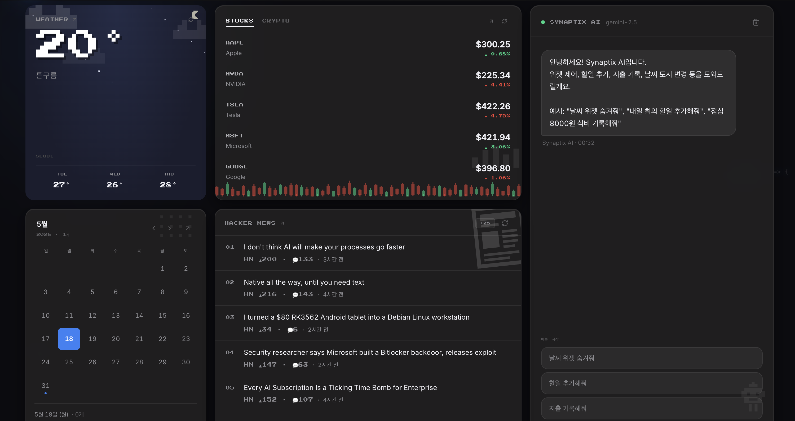
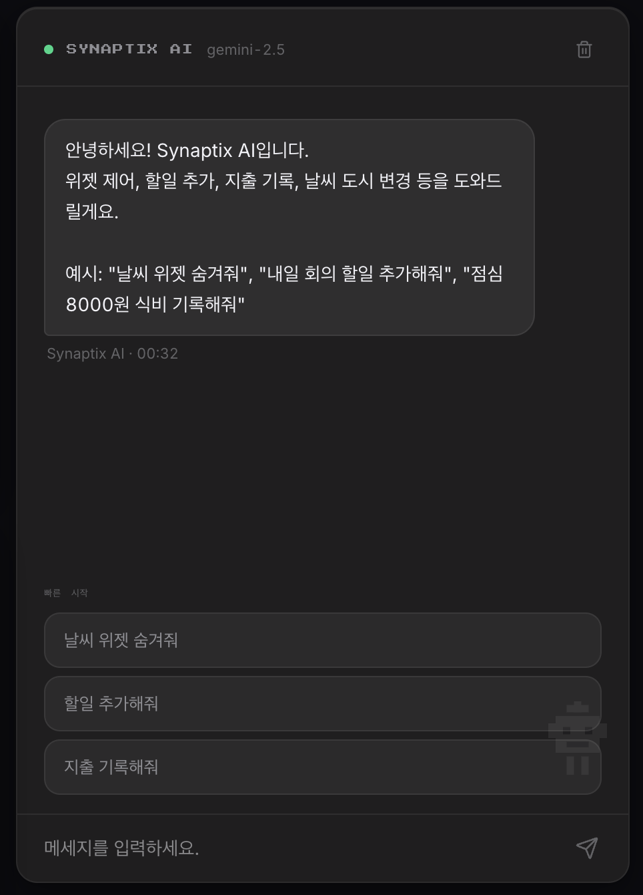
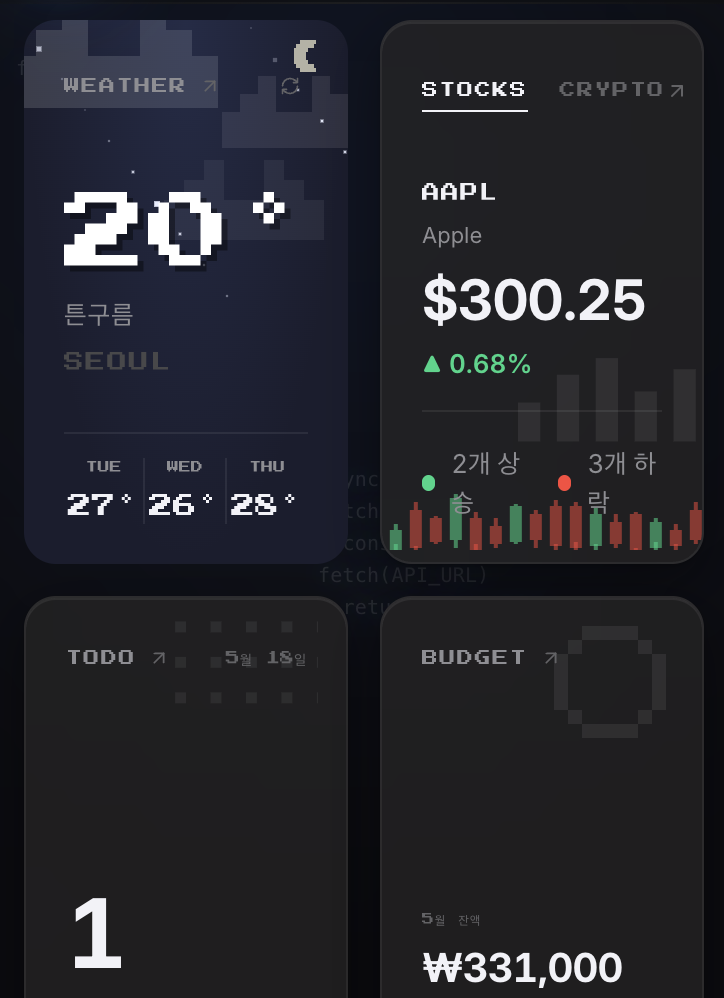

<div align="center">

# Synaptix

**AI 기반 개인 대시보드 — 날씨 · 주식 · 뉴스 · 할 일 · 가계부를 한 화면에서**

자연어로 위젯을 조작하고, 드래그로 레이아웃을 바꾸고, 데이터는 본인 계정에 안전하게 저장됩니다.

> **로그인 없이 바로 둘러볼 수 있어요.** AI 채팅·위젯·할 일·가계부 전부 데모 모드에서 동작합니다.

</div>

> ⚠️ **주의**: 무단 복제는 하지 말아주세요.

---

## 기술 스택

| 카테고리 | 사용 기술 |
| --- | --- |
| **Frontend** | React 19, TypeScript 6, Vite 8 |
| **Styling** | Tailwind CSS 4, Radix UI primitives |
| **상태 관리** | Zustand (persist) + React Query (서버 상태) |
| **AI** | Google Gemini 2.5 Flash (OpenAI-호환 endpoint + Function Calling) |
| **Backend** | Supabase (Postgres + Row Level Security + Google OAuth) |
| **Serverless** | Vercel Edge Functions (Gemini · 외부 API 프록시) |
| **Rate Limit** | Upstash Redis (sliding window) |
| **외부 API** | OpenWeatherMap, Finnhub, CoinGecko, Hacker News |
| **PWA** | vite-plugin-pwa (오프라인 캐시, 홈 추가) |
| **검증** | Zod (LLM tool args 런타임 검증) |

## 배포

- **Platform**: Vercel
- **URL**: (배포 후 추가 예정)

---

## 미리보기

| 데스크톱 대시보드 | AI 채팅 (Tool Calling) | 모바일 |
| :---: | :---: | :---: |
|  |  |  |

---

## 핵심 기능

### AI 어시스턴트 (Function Calling)
Gemini 2.5 Flash가 자연어 명령을 받아 **실제 대시보드 상태를 직접 변경**합니다. OpenAI-호환 엔드포인트 + Tool Calling 스펙으로 구현해 모델 교체가 자유롭습니다.

```
"날씨 위젯 숨겨줘"           → set_widget_visibility(weather, false)
"내일 회의 추가해줘"          → add_todo(title, due_date='2026-05-18')
"점심 김밥 8천원"            → add_transaction(amount=8000, type='expense', ...)
"날씨 도시를 도쿄로 바꿔줘"    → change_weather_city('Tokyo')
```

LLM이 잘못된 형식의 인자를 줄 가능성을 막기 위해 **Zod로 런타임 스키마 검증**을 거치고, 실패하면 throw 대신 tool error로 회신해 LLM이 사용자에게 재질문하도록 유도합니다.

### 데모 모드 — 가입 없이 풀 기능 체험
포트폴리오 방문자가 회원가입 벽 앞에서 이탈하지 않도록 로그인을 **필수가 아니게** 설계했습니다. 같은 React Query 훅(`useTodos`, `useTransactions`)이 세션 유무를 보고 데이터 백엔드를 동적으로 라우팅합니다.

```
useTodos()
  ├─ session  → Supabase (RLS로 본인 행만)
  └─ no session → Zustand + localStorage (이 브라우저에만)
```

- **시드 데이터**: 첫 진입 시 할 일 3개·거래 4개를 오늘 날짜 기준으로 자동 생성. 빈 화면 대신 즉시 "쓸 만하다"는 인상을 주기 위함.
- **AI Tool Calling도 그대로**: `add_todo`/`add_transaction` 같은 LLM 도구도 세션이 없으면 localStorage에 기록.
- **상단 배너**로 "데이터는 이 브라우저에만 저장됨"을 명시해 사용자의 기대치를 맞춰둡니다.

### 위젯들
| 위젯 | 데이터 소스 | 상세 페이지 |
| --- | --- | --- |
| **날씨** | OpenWeatherMap (현재 + 5일 예보, 위치 기반) | 시간별 예보, 일출/일몰, 체감온도 |
| **주식 / 코인** | Finnhub + CoinGecko | 종목별 변동률, 고저가, 거래 차트 |
| **뉴스** | Hacker News | 상위 스토리 + 외부 링크 |
| **캘린더 / 할 일** | Supabase | 월별 뷰, 우선순위, 마감일 |
| **가계부** | Supabase | 카테고리별 파이 차트, 월별 통계 |

### 보안
- **API 키 격리**: 모든 외부 API 키(Gemini, OpenWeather, Finnhub)는 Vercel Edge Function 환경변수에만 존재. 클라이언트 번들에 노출되지 않습니다.
- **Row Level Security**: Supabase 테이블에 `user_id = auth.uid()` 정책을 걸어 본인 데이터만 select/insert/update/delete 가능.
- **Rate Limit**: `/api/chat`은 Upstash Redis sliding window로 IP당 분당 10회 제한 — 봇이 Gemini 무료 쿼터(분당 15회)를 폭격하는 시나리오를 차단.
- **멀티유저 leak 방어**: 같은 브라우저를 여러 사용자가 쓰는 경우를 위해 auth 경계(로그아웃·계정 전환)에서 chat 기록(sessionStorage)과 데모 데이터(localStorage)를 자동 클리어.
- **외부 API 프록시화**: CoinGecko·HackerNews도 Edge Function을 거쳐 호출 → 사용자 IP가 외부 서비스에 직접 노출되지 않고, CDN 캐시로 upstream 호출 빈도가 사용자 수와 무관하게 수렴.

---

## 아키텍처

```
┌──────────────────────────────────────────────────────────┐
│                    Browser (React 19)                     │
│  ┌────────────┐  ┌─────────────┐  ┌──────────────────┐   │
│  │  Widgets   │  │   Zustand   │  │   React Query    │   │
│  │ (drag/drop)│  │  (persist)  │  │  (cache, retry)  │   │
│  └─────┬──────┘  └─────────────┘  └────────┬─────────┘   │
│        │                                    │             │
│        ▼                                    ▼             │
│  ┌──────────────────┐              ┌─────────────────┐   │
│  │  Chat (LLM tool  │              │   External API  │   │
│  │  calling)        │              │   (Weather/HN…) │   │
│  └────────┬─────────┘              └────────┬────────┘   │
└───────────┼─────────────────────────────────┼────────────┘
            │                                  │
            ▼                                  ▼
   ┌────────────────────┐         ┌──────────────────────┐
   │  /api/chat (Edge)  │         │  /api/weather etc.   │
   │  Gemini 프록시 +   │         │  외부 API 프록시 +    │
   │  키 격리 + 재시도 +│         │  Edge 캐시           │
   │  Upstash rate-lim  │         │                      │
   └────────────────────┘         └──────────────────────┘
                                  ┌──────────────────────┐
                                  │  Supabase            │
                                  │  • Auth (Google)     │
                                  │  • Postgres + RLS    │
                                  └──────────────────────┘
```

### 디렉토리 구조
```
src/
├── components/
│   ├── widgets/        # 6종 위젯 + 상세 페이지용 코어
│   ├── navigation/     # TopNav, BottomNav
│   └── ui/             # button, badge, input, spinner
├── pages/
│   ├── Dashboard.tsx   # 메인 그리드 화면
│   ├── Login.tsx       # Google OAuth 로그인
│   └── widgets/        # 위젯별 풀스크린 상세 페이지
├── hooks/              # useWeather, useTodos, useChatSend 등
├── store/              # widgetStore, chatStore, calendarStore (Zustand)
├── lib/
│   ├── api.ts          # 외부 API 클라이언트
│   ├── openai.ts       # 채팅 + Tool 정의
│   ├── supabase.ts     # Supabase 클라이언트
│   ├── queryFallback.ts# mock 폴백 정책
│   └── queryClient.ts  # React Query 설정
└── types/              # 도메인 타입
api/
├── chat.ts             # Gemini 프록시 + Upstash rate limit
├── weather.ts          # OpenWeatherMap 프록시
├── stock.ts            # Finnhub 프록시
├── crypto.ts           # CoinGecko 프록시 (Cache-Control)
└── news.ts             # HackerNews fan-out 프록시 (Cache-Control)
```

---

## 로컬 실행

```bash
git clone https://github.com/yourname/synaptix
cd synaptix
npm install

# .env.example을 복사해 각자의 키 채우기
cp .env.example .env

npm run dev
```

`http://localhost:5173` 접속. 키가 일부 비어 있어도 위젯들은 mock 데이터로 폴백되어 동작합니다.

### 환경 변수
| 변수 | 용도 | 미설정 시 |
| --- | --- | --- |
| `GEMINI_API_KEY` | AI 채팅 | `/api/chat` 500 |
| `OPENWEATHER_API_KEY` | 날씨 위젯 | mock 데이터로 폴백 |
| `FINNHUB_API_KEY` | 주식 위젯 | mock 데이터로 폴백 |
| `UPSTASH_REDIS_REST_URL` / `_TOKEN` | `/api/chat` rate limit | rate limit 미적용 (dev OK, prod 권장) |
| `VITE_SUPABASE_URL` / `_ANON_KEY` | 인증·DB | dev placeholder, prod throw |
| `VITE_SITE_URL` *(선택)* | OAuth redirect 고정 | 현재 origin 사용 |

---

## 프로젝트 소감 및 느낀점

### 프로젝트를 시작한 이유
평소 노션·구글캘린더·증권 앱·날씨 앱을 매일 번갈아 가며 켜는 게 불편했습니다. "한 화면에 다 보여주는 대시보드"는 이미 많지만, 거기에 **자연어로 직접 상태를 바꿀 수 있는** AI 어시스턴트가 붙으면 어떨까 궁금했어요. 동시에 LLM의 Function Calling, Vercel Edge Functions, Supabase RLS 같이 한 번도 깊이 다뤄보지 못한 기술들을 한 프로젝트에 묶어보고 싶었습니다.

### 처음 시작할 때의 고민
가장 큰 고민은 **"LLM이 정말로 내 앱의 상태를 안전하게 바꿀 수 있을까"** 였습니다. LLM이 잘못된 인자를 주거나, 존재하지 않는 도구를 호출하거나, 사용자가 의도하지 않은 명령으로 해석할 가능성이 무서웠어요. 결국 LLM 출력을 "신뢰할 수 없는 입력"으로 다루기로 결정하고, 모든 tool 호출 경계에서 Zod 런타임 검증을 거치도록 설계한 게 첫 번째 큰 결정이었습니다.

두 번째 고민은 **"로그인 강제 vs 가입 없이 둘러보기"** 였습니다. 포트폴리오로 공개할 거라면 방문자가 가입 화면에서 이탈하는 비용이 크다고 판단해, 같은 React Query 훅이 세션 유무에 따라 Supabase와 localStorage 사이를 동적으로 라우팅하도록 구조를 짰습니다.

### 프로젝트를 진행하며 배워나간 과정

#### 1. LLM Function Calling — 신뢰할 수 없는 입력 다루기
Gemini의 OpenAI-호환 엔드포인트를 쓰면서 처음에는 LLM이 보내는 인자를 그대로 `as number`로 캐스팅했습니다. 하지만 LLM이 `amount`로 `"8000원"` 같은 문자열을 보내거나, `priority`에 정의되지 않은 `'urgent'` 값을 보내는 일이 실제로 일어났어요. 결국 모든 tool 인자에 Zod 스키마를 적용하고, 검증 실패 시 throw가 아닌 **tool error 메시지로 LLM에 회신**해 LLM이 사용자에게 재질문하도록 흐름을 바꿨습니다.

```ts
const ToolSchemas = {
  add_transaction: z.object({
    amount: z.number().positive().finite(),
    type: z.enum(['income', 'expense']),
    category: z.string().min(1).max(50),
    description: z.string().min(1).max(200),
  }),
  // ...
}
const parsed = schema.safeParse(rawArgs)
if (!parsed.success) {
  return { success: false, error: `Invalid arguments: ${parsed.error.message}` }
}
```

#### 2. Edge Function 프록시 — 키 격리와 사용자 IP 보호
외부 API를 클라이언트에서 직접 부르면 (1) API 키가 클라이언트 번들에 노출되거나 (2) 사용자 IP가 외부 서비스로 새어 나갑니다. Gemini·OpenWeather·Finnhub·CoinGecko·HackerNews 모두 Vercel Edge Function 뒤에 숨기고, 응답에 `Cache-Control: s-maxage`를 붙여 Vercel CDN이 캐싱하도록 했습니다. 덕분에 CoinGecko 호출이 사용자 수와 무관하게 분당 ~1회로 수렴합니다.

#### 3. Row Level Security — 권한을 DB 레이어로 끌어내리기
"클라이언트에서 `where user_id = me`로 필터링하면 되겠지" 하다가 RLS의 진짜 가치를 깨달았습니다. 클라이언트 필터는 **클라이언트를 신뢰하는 설계**라서, JWT만 있으면 누구나 SQL을 직접 쏴 다른 사용자 데이터를 읽을 수 있어요. Supabase의 RLS 정책으로 `auth.uid() = user_id`를 강제하면, 잘못된 클라이언트 코드를 짜도 DB가 차단합니다. 보안은 가장 안쪽 레이어에서 거는 게 맞다는 걸 체감했습니다.

#### 4. PWA — 모바일에서 진짜 앱처럼
`vite-plugin-pwa`로 manifest와 service worker를 자동 생성하고, iOS Safari "홈에 추가"에서도 아이콘이 깨지지 않도록 `apple-touch-icon`을 별도 PNG로 제공했습니다. 처음엔 SVG 하나로 충분할 줄 알았는데, iOS는 PNG 180×180을 따로 요구한다는 걸 직접 테스트해 보고 알았습니다.

### 트러블슈팅

#### Gemini 503/429를 사용자에게 그대로 보여주지 않기
Gemini 무료 tier는 부하 시 503(UNAVAILABLE)을 종종 던지고, 쿼터 초과 시 429를 줍니다. 사용자에게 "503"이 그대로 노출되면 무슨 일인지 모릅니다. 해결:
- **503**: 1.5초 후 한 번 재시도 → 그래도 실패하면 친화적 메시지로 변환
- **tool call 4xx 실패**: tool 없이 한 번 더 호출해 텍스트 응답으로 폴백 (모델이 tool spec을 잘못 이해한 경우 대비)
- **429**: "잠시 사용량이 많아요. 1분 후 다시 시도해주세요."

#### `/api/chat` 쿼터 폭격 시나리오 — Upstash로 방어
Gemini 무료 tier는 분당 15회/일 1500회 제한이 있습니다. 누군가 봇으로 `/api/chat`을 두드리면 하루 안에 잠겨서 정상 사용자가 못 씁니다. Upstash Redis로 IP당 분당 10회 sliding window를 적용했고, 429 응답에 `Retry-After`와 `X-RateLimit-*` 헤더를 함께 내려 클라이언트가 다음 시도 시점을 알 수 있게 했습니다.

#### 멀티유저 브라우저 데이터 leak
카페 공용 노트북 같은 시나리오에서, User A가 로그아웃한 후 User B가 같은 탭에서 로그인하면 A의 채팅 기록(sessionStorage)이 그대로 보이는 문제가 있었습니다. `useAuth`의 `onAuthStateChange`에서 **이전 user_id와 다른 사용자가 로그인하거나 SIGNED_OUT 이벤트가 발생하면** chat·demo 스토어를 즉시 클리어하도록 수정했습니다.

#### Supabase placeholder URL silent fail
환경 변수가 빠진 채 prod에 배포되면 `'https://placeholder.supabase.co'`로 폴백되어 로그인 버튼을 누를 때까지 문제를 모릅니다. **prod 빌드에서는 모듈 로드 시점에 throw**하도록 바꾸고, dev에서는 warn + Login 버튼을 명시적으로 비활성화해 빠르게 알아챌 수 있게 했습니다.

#### SPA 직접 URL 진입 시 404
`/widgets/budget` 같은 경로로 직접 진입하면 Vercel이 정적 404를 반환하는 문제를 만났습니다. `vercel.json`에 `/api/*`를 제외한 모든 경로를 `/`로 rewrite하는 규칙을 추가해 해결.

### 깨달은 점들

#### LLM은 또 하나의 "신뢰할 수 없는 사용자"다
SQL injection을 막듯 LLM 출력도 검증해야 한다는 게 가장 큰 교훈입니다. Tool args를 그대로 DB에 insert하는 코드를 짜고 나니, "LLM이 일관성 있게 동작할 것"이라는 가정이 얼마나 위험한지 보였습니다.

#### 보안은 가장 안쪽에서 걸어야 한다
RLS는 처음엔 "이중 검증 아닌가?" 싶었는데, 클라이언트·서버·DB 중 어느 한 레이어가 뚫려도 데이터가 새지 않으려면 가장 안쪽에서 거는 게 필수라는 걸 알게 됐습니다. 방어선이 여러 겹이라는 게 핵심.

#### 외부 의존성은 항상 폴백을 준비한다
OpenWeather가 다운되면 위젯이 깨지는 게 아니라 mock 데이터로 자연스럽게 폴백해야 한다는 원칙을 모든 위젯에 적용했습니다. `isDemoMode` 플래그를 노출해 UI에서 "DEMO" 뱃지로 명시. 외부 API에 의존하는 모든 코드는 "이 API가 영원히 다운돼도 내 앱은 동작해야 한다"는 기준으로 짜야 한다는 걸 배웠습니다.

#### 데모 모드는 단순한 기능이 아니라 전체 아키텍처 결정이다
"로그인 없이 둘러보기"를 후순위 옵션으로 두면 두 코드 경로가 분기되어 유지보수가 지옥이 됩니다. 처음부터 같은 훅이 두 백엔드를 라우팅하도록 설계해야 LLM Tool Calling 같은 새 기능도 자동으로 데모 모드를 지원하게 됩니다.

### 앞으로의 계획
- **테스트 커버리지** — `useChatSend`의 tool routing 같은 핵심 로직에 Vitest 단위 테스트 추가
- **에러 모니터링** — Sentry/PostHog 연동해 production에서 발생하는 에러를 실시간으로 추적
- **위젯 확장성** — 사용자가 자신만의 위젯을 정의할 수 있도록 플러그인 시스템 검토
- **LLM 응답 캐싱** — 같은 질문이 반복될 때 prompt cache로 비용·응답 시간 절감
- **접근성 (a11y)** — 키보드 네비게이션, 스크린 리더 호환성 강화

### 마무리
이번 프로젝트로 단순히 "기능을 구현"하는 것을 넘어, **각 결정의 보안적/UX적 함의를 한 단계 더 깊이 생각하는 습관**을 들이게 됐습니다. LLM을 "신뢰할 수 없는 입력"으로 다루고, 보안을 가장 안쪽 레이어에 두고, 외부 의존성에는 폴백을 준비하는 — 이런 원칙들은 다음 프로젝트에서도 그대로 가져갈 자산입니다.

기술적 호기심으로 시작했지만, 결국 배운 가장 큰 건 "사용자가 이걸 어떻게 쓸까"와 "이게 망가질 수 있는 모든 경로"를 동시에 떠올리는 사고방식이었습니다. 앞으로도 어제의 자신을 실력으로 찍어 누를 수 있는 개발자가 되기 위해 끝까지 노력하겠습니다.
