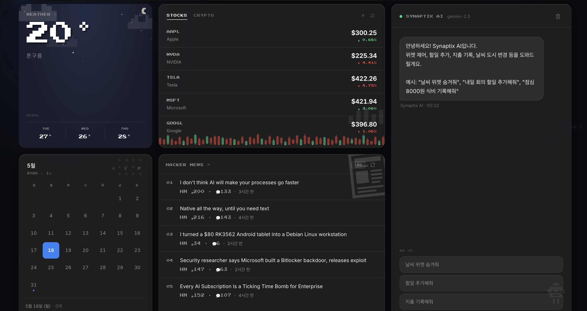
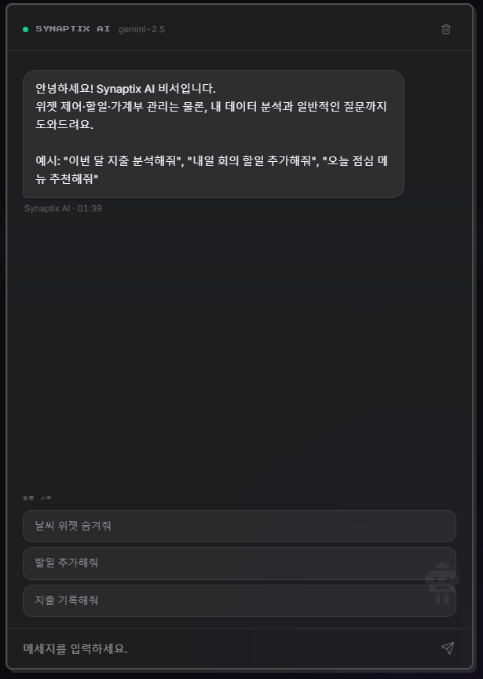
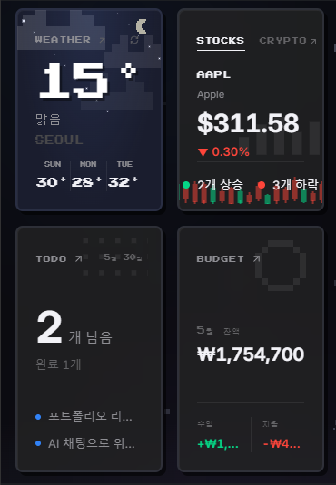

<div align="center">

# Synaptix

**AI 기반 개인 대시보드 — 날씨 · 주식 · 뉴스 · 할 일 · 가계부 · GitHub를 한 화면에서**

자연어(텍스트 또는 **음성**)로 위젯을 조작하고, 드래그로 레이아웃을 바꾸고, 데이터는 본인 계정에 안전하게 저장됩니다.

[](https://github.com/GojaeDoo/Synaptix/actions/workflows/ci.yml)

> **로그인 없이 바로 둘러볼 수 있어요.** AI 채팅·위젯·할 일·가계부 전부 데모 모드에서 동작합니다.

</div>

> ⚠️ **주의**: 무단 복제는 하지 말아주세요.

---

## 기술 스택

| 카테고리 | 사용 기술 |
| --- | --- |
| **Frontend** | React 19, TypeScript 6 (`strict`), Vite 8 |
| **Styling** | Tailwind CSS 4, Radix UI primitives |
| **상태 관리** | Zustand (persist) + React Query (서버 상태) |
| **AI** | Google Gemini 2.5 Flash (OpenAI-호환 endpoint + Function Calling) |
| **Backend** | Supabase (Postgres + Row Level Security + Google OAuth) |
| **Serverless** | Vercel Edge Functions (Gemini · 외부 API 프록시) |
| **Rate Limit** | Upstash Redis (sliding window) |
| **외부 API** | OpenWeatherMap, Finnhub, CoinGecko, Hacker News, GitHub GraphQL |
| **PWA** | vite-plugin-pwa (오프라인 캐시, 홈 추가, **Web Push 알림**) |
| **푸시 알림** | Web Push (VAPID) + `web-push` + Vercel Cron (일정 하루 전 발송) |
| **검증** | Zod (LLM tool args 런타임 검증) |
| **테스트 · CI** | Vitest 79개 (위젯 순수 로직 · 검증기 · API 매퍼 · 예보 집계) + GitHub Actions (lint · typecheck · test · build) |

## 배포

- **Platform**: Vercel
- **URL**: https://synaptix-ten.vercel.app

---

## 미리보기

| 데스크톱 대시보드 | AI 채팅 (Tool Calling) | 모바일 |
| :---: | :---: | :---: |
|  |  |  |

---

## 핵심 기능

### AI 어시스턴트 (Function Calling)
Gemini 2.5 Flash가 자연어 명령을 받아 **실제 대시보드 상태를 직접 변경**합니다. OpenAI-호환 엔드포인트 + Tool Calling 스펙으로 구현해 모델 교체가 자유롭습니다.

```
"날씨 위젯 숨겨줘"           → set_widget_visibility(weather, false)
"내일 회의 추가해줘"          → add_todo(title, due_date='2026-05-18')
"점심 김밥 8천원"            → add_transaction(amount=8000, type='expense', ...)
"날씨 도시를 도쿄로 바꿔줘"    → change_weather_city('Tokyo')
```

LLM이 잘못된 형식의 인자를 줄 가능성을 막기 위해 **Zod로 런타임 스키마 검증**을 거치고, 실패하면 throw 대신 tool error로 회신해 LLM이 사용자에게 재질문하도록 유도합니다.

단순 명령 실행기에 그치지 않고 **개인 비서**로 동작합니다. 도구에 딱 맞지 않는 일반적인 질문(조언·요약·계산·추천 등)에도 답하고, 분석을 요청하면 실제 데이터를 조회해 사용자의 숫자를 근거로 답합니다.

```
"이번 달 지출 분석해줘"  → query_transactions → "식비 비중이 가장 커요. 외식을 주 1회 줄이면 약 N원 절약돼요."
```

채팅은 **모든 페이지에서** 열립니다 — 모바일은 하단 시트, 데스크톱은 상단 네비의 `AI` 버튼으로 여는 우측 드로어. 무료 모델(Gemini Flash) 비용을 위해 API로 보내는 대화 히스토리는 최근 N개로 캡합니다(화면에는 전체 유지).

### AI 음성 입력 (Web Speech API)

마이크 버튼 하나로 **말로 AI에게 명령**할 수 있습니다.

```
마이크 버튼 탭 → 픽셀 도트 웨이브 애니메이션 + "듣고 있습니다..."
    ↓ 말하는 동안 실시간으로 인식 텍스트가 입력창에 반영
더듬거나 잠깐 쉬어도 계속 듣는 중 (continuous mode)
    ↓ 버튼 다시 탭 → 인식 완료, 입력창에서 내용 확인 후 전송
```

- **`continuous: true`** — 짧은 침묵에 중단되지 않아 자연스럽게 말할 수 있습니다
- **수동 전송** — 말이 끝나도 자동 전송하지 않아 인식 오류를 수정할 시간을 줍니다
- **픽셀 도트 웨이브** — 앱의 도트풍 디자인에 맞게 24개 픽셀 도트가 파도치는 애니메이션
- **실시간 미리보기** — 인식되는 텍스트를 즉시 확인해 오인식 여부를 바로 파악
- **에러 안내** — 마이크 권한 거부 / 말소리 미감지 / 인식 실패 상황별 메시지
- **미지원 브라우저 자동 숨김** — `SpeechRecognition` 미지원 환경(Firefox 등)에서는 마이크 버튼이 표시되지 않습니다

### 데모 모드 — 가입 없이 풀 기능 체험
포트폴리오 방문자가 회원가입 벽 앞에서 이탈하지 않도록 로그인을 **필수가 아니게** 설계했습니다. 같은 React Query 훅(`useTodos`, `useTransactions`)이 세션 유무를 보고 데이터 백엔드를 동적으로 라우팅합니다.

```
useTodos()
  ├─ session  → Supabase (RLS로 본인 행만)
  └─ no session → Zustand + localStorage (이 브라우저에만)
```

- **시드 데이터**: 첫 진입 시 할 일 3개·거래 4개를 오늘 날짜 기준으로 자동 생성. 빈 화면 대신 즉시 "쓸 만하다"는 인상을 주기 위함.
- **AI Tool Calling도 그대로**: `add_todo`/`add_transaction` 같은 LLM 도구도 세션이 없으면 localStorage에 기록.
- **상단 배너**로 "데이터는 이 브라우저에만 저장됨"을 명시해 사용자의 기대치를 맞춰둡니다.

### 위젯들
| 위젯 | 데이터 소스 | 상세 페이지 |
| --- | --- | --- |
| **날씨** | OpenWeatherMap (현재 + 5일 예보, 위치 기반) | 시간별 예보, 일출/일몰, 체감온도 |
| **주식 / 코인** | Finnhub + CoinGecko | 종목별 변동률, 고저가, 거래 차트 |
| **뉴스** | Hacker News | 상위 스토리 + 외부 링크 |
| **캘린더 / 할 일** | Supabase | 월별 뷰, 우선순위, 마감일, **하루 전 푸시 알림** |
| **가계부** | Supabase | 카테고리별 파이 차트, 월별 통계 |
| **장소 / 코스** | 카카오 로컬 검색 API + 카카오 지도 JS SDK | 키워드 지도 검색, 코스 동선 빌더, 일정 추가 |
| **GitHub** | GitHub GraphQL API | 1년치 잔디(기여 그래프), 총 기여수, 연속 스트릭 |

### GitHub 잔디 위젯

개발자 포트폴리오에 어울리는 **GitHub 기여 그래프 위젯**입니다.

```
GitHub GraphQL API (/api/github Edge Function)
    ↓ GITHUB_TOKEN으로 1년치 contributionCalendar 조회
    ↓ Cache-Control: max-age=3600 (CDN 캐시)
GithubWidget
    ├─ 기여 그래프 — 52주 × 7일 SVG 그리드 (블루 컬러 스케일)
    ├─ 총 기여수 (contributions)
    ├─ 연속 스트릭 (streak) — 오늘 기준 연속 커밋일 수
    └─ 클릭 시 GitHub 프로필 열기
```

- **블루 컬러 스케일** — 기여 횟수에 따라 4단계 투명도 (`rgba(49,130,246,0.22)` → `#3182F6`)로 앱 테마와 일치
- **반응형 SVG** — `viewBox`로 위젯 크기에 따라 자동 스케일
- **`GITHUB_TOKEN` 미설정 시** — "SETUP REQUIRED" 안내 화면으로 폴백, 앱 전체에 영향 없음
- **AI 제어 가능** — `"github 위젯 보여줘"` 명령으로 표시/숨기기

### 장소 검색 & 코스 빌더

#### 장소 검색
카카오 로컬 API로 키워드 기반 장소 검색을 제공합니다. REST 키는 Edge Function 뒤에 숨겨 클라이언트에 노출되지 않으며, 카카오 지도 JS SDK(`VITE_KAKAO_JS_KEY`)는 도메인 제한 키라 클라이언트 노출이 안전합니다.

```
사용자 입력 "강남 파스타"
    ↓
/api/places?query=강남+파스타&x=lng&y=lat   (Edge Function 프록시)
    ↓ KAKAO_REST_API_KEY 헤더 추가
카카오 /v2/local/search/keyword.json
    ↓ 결과 매핑 (road_address_name 우선, 카테고리 정규화)
PlaceResultList + PlaceMap (카카오 지도 JS SDK 마커)
```

- **현재 위치 기반 거리 정렬**: `useMyLocation` 훅으로 브라우저 Geolocation을 1회 조회해 `x/y` 파라미터로 전달. 좌표가 있으면 거리순, 없으면 정확도순으로 정렬됩니다.
- **카테고리 썸네일**: 카카오 API는 사진을 반환하지 않으므로 카테고리명 기반으로 아이콘 + 컬러 썸네일을 클라이언트에서 생성합니다 (카페→갈색, 음식점→레드 등).
- **데모 모드 폴백**: `KAKAO_REST_API_KEY` 미설정 시 서버가 503을 반환하고, 클라이언트는 서울 대표 장소 6곳의 mock 데이터로 자동 폴백합니다.
- **지도 폴백**: `VITE_KAKAO_JS_KEY` 미설정 또는 SDK 로드 실패 시 지도 대신 리스트 뷰만 표시하며 검색·일정 기능은 그대로 동작합니다.

#### 코스 빌더 (동선 편집기)
검색 결과에서 장소를 골라 **데이트·나들이 동선**을 직접 만들 수 있습니다.

```
검색 결과 → [코스 추가] 버튼
    ↓ useCourseStore (Zustand)
CoursePanel — 정류장(stop) 목록
    ↓ 각 정류장: 방문 시간, 이동 수단, 메모 편집
지도 뷰 전환 → "내 코스" 탭
    ↓ PlaceMap (ordered=true)
번호 마커 + 순서대로 잇는 폴리라인
    ↓ [공유] 버튼
/course?data=<base64 인코딩된 JSON>  ← URL 하나로 공유
    ↓ CourseView 페이지 (지도 + 타임라인)
[일정으로 내보내기] → 각 stop을 Supabase Todo로 일괄 저장
```

- **Zustand 코스 스토어**: 정류장 추가/삭제/순서 변경, 시간 및 메모 편집이 Zustand로 관리되며 페이지를 이동해도 코스가 유지됩니다.
- **폴리라인 지도 시각화**: 코스 보기 전환 시 각 정류장에 순번 마커(①②③…)를 찍고, 방문 순서대로 라인을 그려 동선을 한눈에 파악할 수 있습니다.
- **URL 공유**: 코스 JSON을 base64로 인코딩해 URL에 담아 외부 공유가 가능합니다. 수신자는 별도 로그인 없이 공유된 코스를 지도에서 확인할 수 있습니다.
- **일정 연동**: 코스를 캘린더 할 일로 일괄 내보내면 각 장소가 `due_date`와 `location` 메타가 붙은 Todo로 저장되어 푸시 리마인더 대상이 됩니다.

### 푸시 리마인더 (Web Push)
홈 화면에 추가한 PWA에 **카톡처럼 백그라운드 알림**을 보냅니다. 앱을 켜두지 않아도, 화면이 꺼져 있어도 일정 하루 전 아침에 푸시가 도착합니다.

```
[클라이언트] 캘린더 페이지 → "알림 받기" 토글 → 권한 허용
        ↓ PushManager.subscribe (VAPID 공개키)
[Supabase] push_subscriptions 테이블 (RLS: 본인 구독만)
        ↓ 매일 23:00 UTC (= 08:00 KST)
[Vercel Cron] /api/send-reminders → 내일 일정 있는 사용자 조회 → web-push 발송
        ↓ Apple/Google/Mozilla 푸시 서비스
[폰] 서비스워커 push 이벤트 → 알림 표시 → 클릭 시 캘린더 열기
```

- **iOS 제약**: Safari 일반 탭은 푸시 미지원. iOS 16.4+ 이며 **홈 화면 PWA에서만** 동작 — 토글 버튼이 미지원 환경에서는 자동으로 안내 문구로 바뀝니다.
- **만료 구독 자동 정리**: 발송 시 410 Gone 응답이 오면 (예: 사용자가 홈 아이콘 삭제) 해당 구독을 DB에서 즉시 삭제해 다음 cron에서 무효 발송이 누적되지 않게 했습니다.
- **VAPID 비밀키 격리**: `VAPID_PRIVATE_KEY` · `SUPABASE_SERVICE_ROLE_KEY` 는 서버 환경변수에만 두고 `VITE_` 접두사를 붙이지 않아 클라이언트 번들에 절대 포함되지 않습니다.
- **Cron 엔드포인트 인증**: `/api/send-reminders`는 공개 URL이므로 `Authorization: Bearer <CRON_SECRET>` 헤더 검증 — 외부 호출자가 발송을 트리거할 수 없습니다.

### 보안
- **API 키 격리**: 모든 외부 API 키(Gemini, OpenWeather, Finnhub)는 Vercel Edge Function 환경변수에만 존재. 클라이언트 번들에 노출되지 않습니다.
- **Row Level Security**: Supabase 테이블에 `user_id = auth.uid()` 정책을 걸어 본인 데이터만 select/insert/update/delete 가능.
- **Rate Limit**: `/api/chat`은 Upstash Redis sliding window로 IP당 분당 10회 제한 — 봇이 Gemini 무료 쿼터(분당 15회)를 폭격하는 시나리오를 차단.
- **LLM 비용 통제**: 모델에 보내는 대화 히스토리를 최근 N개로 캡해 토큰 사용량을 제한 — 긴 세션에서도 요청당 컨텍스트가 무한정 늘지 않도록 방어.
- **멀티유저 leak 방어**: 같은 브라우저를 여러 사용자가 쓰는 경우를 위해 auth 경계(로그아웃·계정 전환)에서 chat 기록(sessionStorage)과 데모 데이터(localStorage)를 자동 클리어.
- **외부 API 프록시화**: CoinGecko·HackerNews도 Edge Function을 거쳐 호출 → 사용자 IP가 외부 서비스에 직접 노출되지 않고, CDN 캐시로 upstream 호출 빈도가 사용자 수와 무관하게 수렴.

---

## 아키텍처

```
┌──────────────────────────────────────────────────────────┐
│                    Browser (React 19)                     │
│  ┌────────────┐  ┌─────────────┐  ┌──────────────────┐   │
│  │  Widgets   │  │   Zustand   │  │   React Query    │   │
│  │ (drag/drop)│  │  (persist)  │  │  (cache, retry)  │   │
│  └─────┬──────┘  └─────────────┘  └────────┬─────────┘   │
│        │                                    │             │
│        ▼                                    ▼             │
│  ┌──────────────────┐              ┌─────────────────┐   │
│  │  Chat (LLM tool  │              │   External API  │   │
│  │  calling)        │              │   (Weather/HN…) │   │
│  └────────┬─────────┘              └────────┬────────┘   │
└───────────┼─────────────────────────────────┼────────────┘
            │                                  │
            ▼                                  ▼
   ┌────────────────────┐         ┌──────────────────────┐
   │  /api/chat (Edge)  │         │  /api/weather,stock  │
   │  Gemini 프록시 +   │         │  crypto,news,github  │
   │  키 격리 + 재시도 +│         │  외부 API 프록시 +    │
   │  Upstash rate-lim  │         │  Edge 캐시           │
   └────────────────────┘         └──────────────────────┘
                                  ┌──────────────────────┐
                                  │  Supabase            │
                                  │  • Auth (Google)     │
                                  │  • Postgres + RLS    │
                                  └──────────────────────┘
```

### 디렉토리 구조
```
src/
├── components/
│   ├── widgets/        # 대시보드 위젯 카드 + 반응형 AI 채팅 패널(ChatPanel)
│   ├── navigation/     # TopNav, BottomNav
│   └── ui/             # button, badge, input, spinner
├── pages/
│   ├── Dashboard.tsx   # 메인 그리드 화면
│   ├── Login.tsx       # Google OAuth 로그인
│   └── widgets/        # 위젯별 상세 페이지(*Detail.tsx) — 각 위젯은
│       │               #   하위 폴더로 컴포넌트·상수를 분리해 얇은 오케스트레이터로 유지
│       ├── budget/     #   예: SummaryCards, BudgetCharts, TransactionListCard, constants…
│       ├── places/     #   PlaceMap, PlaceResultList, CoursePanel, CourseTimeline, constants…
│       ├── weather/  calendar/  stocks/  news/
│   ├── CourseView.tsx  # 공유 코스 조회 페이지 (/course?data=…)
├── hooks/              # useWeather, useTodos, useChatSend, useBudgetRange, useGithub 등
├── store/              # widgetStore, chatStore, calendarStore, demoStore (Zustand)
├── lib/
│   ├── api.ts          # 외부 API 클라이언트 (+ api.test.ts)
│   ├── budget.ts / weather.ts / stocks.ts / news.ts / todos.ts / forecast.ts
│   │                   # 위젯별 순수 로직 — UI/상태와 분리해 단위 테스트(*.test.ts)
│   ├── openai.ts       # 채팅 시스템 프롬프트 + Tool 정의
│   ├── supabase.ts     # Supabase 클라이언트
│   ├── push.ts         # 웹 푸시 구독/해제 + Supabase 저장
│   ├── queryFallback.ts# mock 폴백 정책
│   └── queryClient.ts  # React Query 설정
└── types/              # 도메인 타입
public/
└── sw-push.js          # 서비스워커 push/notificationclick 핸들러 (workbox importScripts)
api/
├── chat.ts             # Gemini 프록시 + Upstash rate limit
├── weather.ts          # OpenWeatherMap 프록시
├── stock.ts            # Finnhub 프록시
├── crypto.ts           # CoinGecko 프록시 (Cache-Control)
├── news.ts             # HackerNews fan-out 프록시 (Cache-Control)
├── github.ts           # GitHub GraphQL 프록시 (GITHUB_TOKEN, Cache-Control 1h)
└── send-reminders.ts   # 일정 하루 전 푸시 발송 (Vercel Cron, Node 런타임)
```

---

## 로컬 실행

```bash
git clone https://github.com/yourname/synaptix
cd synaptix
npm install

# .env.example을 복사해 각자의 키 채우기
cp .env.example .env

npm run dev
```

`http://localhost:5173` 접속. 키가 일부 비어 있어도 위젯들은 mock 데이터로 폴백되어 동작합니다.

### 환경 변수
| 변수 | 용도 | 미설정 시 |
| --- | --- | --- |
| `GEMINI_API_KEY` | AI 채팅 | `/api/chat` 500 |
| `OPENWEATHER_API_KEY` | 날씨 위젯 | mock 데이터로 폴백 |
| `FINNHUB_API_KEY` | 주식 위젯 | mock 데이터로 폴백 |
| `KAKAO_REST_API_KEY` | 장소 키워드 검색 (서버 전용) | mock 장소 6곳으로 폴백 |
| `VITE_KAKAO_JS_KEY` | 카카오 지도 JS SDK (클라이언트) | 지도 미표시, 리스트만 동작 |
| `UPSTASH_REDIS_REST_URL` / `_TOKEN` | `/api/chat` rate limit | rate limit 미적용 (dev OK, prod 권장) |
| `VITE_SUPABASE_URL` / `_ANON_KEY` | 인증·DB | dev placeholder, prod throw |
| `VITE_SITE_URL` *(선택)* | OAuth redirect 고정 | 현재 origin 사용 |
| `VITE_VAPID_PUBLIC_KEY` | 클라이언트 푸시 구독 | 알림 기능 비활성 |
| `VAPID_PUBLIC_KEY` / `_PRIVATE_KEY` / `_SUBJECT` | 서버 푸시 발송 (web-push) | 알림 기능 비활성 |
| `SUPABASE_SERVICE_ROLE_KEY` | Cron이 전체 사용자 일정 조회 (RLS 우회) | Cron 발송 503 |
| `CRON_SECRET` | `/api/send-reminders` 호출자 인증 | 검증 미적용 (prod 권장) |
| `GITHUB_TOKEN` | GitHub 잔디 위젯 (GraphQL API, `read:user` scope) | 위젯 "SETUP REQUIRED" 안내 표시 |

> **카카오 지도 도메인 등록 필수**: `VITE_KAKAO_JS_KEY`는 [카카오 Developers](https://developers.kakao.com) 콘솔에서 **플랫폼 → Web → 사이트 도메인**에 배포 URL(`https://your-app.vercel.app`)을 등록해야 작동합니다. 미등록 시 지도 SDK 로드가 차단됩니다.

---

## 프로젝트 소감 및 느낀점

### 프로젝트를 시작한 이유
평소 노션·구글캘린더·증권 앱·날씨 앱을 매일 번갈아 가며 켜는 게 불편했습니다. "한 화면에 다 보여주는 대시보드"는 이미 많지만, 거기에 **자연어로 직접 상태를 바꿀 수 있는** AI 어시스턴트가 붙으면 어떨까 궁금했어요. 동시에 LLM의 Function Calling, Vercel Edge Functions, Supabase RLS 같이 한 번도 깊이 다뤄보지 못한 기술들을 한 프로젝트에 묶어보고 싶었습니다.

### 처음 시작할 때의 고민

#### 0. Next.js에서 Vite로 마이그레이션한 이유

이 프로젝트는 처음에 **Next.js App Router** 기반으로 시작했습니다. Next.js는 현재 프론트엔드 생태계의 사실상 표준이고, 파일 기반 라우팅과 서버 컴포넌트가 편리했습니다. 그러나 기능을 붙여가면서 **Next.js의 장점이 이 앱에서는 거의 발휘되지 않는다**는 걸 체감했고, 결국 Vite + React SPA로 전환했습니다.

**Next.js를 떠난 핵심 이유**

| Next.js 장점 | 이 앱에서의 현실 |
| --- | --- |
| SSR/SSG로 SEO 최적화 | 로그인 기반 개인 대시보드 — 검색 엔진에 노출될 페이지가 없음 |
| 서버 컴포넌트로 초기 로드 최적화 | 모든 데이터가 Supabase·외부 API에서 실시간으로 오므로 서버에서 pre-render할 정적 데이터가 없음 |
| 파일 기반 라우팅 | React Router v6의 `lazy()` 코드 스플리팅으로 충분히 대체 가능 |

결정적으로 위젯 대부분이 `Geolocation`, `Kakao Map JS SDK`, `Web Push`, `SpeechRecognition` 등 **브라우저 전용 API**에 의존합니다. Next.js App Router를 쓰더라도 거의 모든 컴포넌트에 `'use client'`를 달아야 했고, 서버 컴포넌트의 이점을 전혀 누리지 못하면서 Next.js 특유의 복잡도(hydration, 서버/클라이언트 경계 관리)만 떠안는 상황이었습니다.

**Vite로 전환하면서 얻은 것**

- `/api/*.ts` Vercel Edge Function 구조를 그대로 유지 — Next.js의 `app/api/route.ts` 포맷으로 변환할 필요 없음
- HMR 속도 향상과 번들 설정 단순화
- `vite-plugin-pwa`로 PWA·서비스워커 통합이 훨씬 직관적
- 클라이언트 헤비한 SPA에 최적화된 구조로 코드베이스가 단순해짐

**결론**: "좋은 기술"과 "이 앱에 맞는 기술"은 다릅니다. Next.js가 더 유명하고 포트폴리오에 보기 좋아 보이더라도, 실제로 그 강점이 발휘되지 않는 앱에 억지로 끼워 맞추는 건 오히려 복잡도만 늘린다는 걸 직접 경험했습니다.

---

가장 큰 고민은 **"LLM이 정말로 내 앱의 상태를 안전하게 바꿀 수 있을까"** 였습니다. LLM이 잘못된 인자를 주거나, 존재하지 않는 도구를 호출하거나, 사용자가 의도하지 않은 명령으로 해석할 가능성이 무서웠습니다. 결국 LLM 출력을 "신뢰할 수 없는 입력"으로 다루기로 결정하고, 모든 tool 호출 경계에서 Zod 런타임 검증을 거치도록 설계한 게 첫 번째 큰 결정이었습니다.

두 번째 고민은 **"로그인 강제 vs 가입 없이 둘러보기"** 였습니다. 포트폴리오로 공개할 거라면 방문자가 가입 화면에서 이탈하는 비용이 크다고 판단해, 같은 React Query 훅이 세션 유무에 따라 Supabase와 localStorage 사이를 동적으로 라우팅하도록 구조를 짰습니다.

### 프로젝트를 진행하며 배워나간 과정

#### 1. LLM Function Calling — 신뢰할 수 없는 입력 다루기
Gemini의 OpenAI-호환 엔드포인트를 쓰면서 처음에는 LLM이 보내는 인자를 그대로 `as number`로 캐스팅했습니다. 하지만 LLM이 `amount`로 `"8000원"` 같은 문자열을 보내거나, `priority`에 정의되지 않은 `'urgent'` 값을 보내는 일이 실제로 일어났어요. 결국 모든 tool 인자에 Zod 스키마를 적용하고, 검증 실패 시 throw가 아닌 **tool error 메시지로 LLM에 회신**해 LLM이 사용자에게 재질문하도록 흐름을 바꿨습니다.

```ts
const ToolSchemas = {
  add_transaction: z.object({
    amount: z.number().positive().finite(),
    type: z.enum(['income', 'expense']),
    category: z.string().min(1).max(50),
    description: z.string().min(1).max(200),
  }),
  // ...
}
const parsed = schema.safeParse(rawArgs)
if (!parsed.success) {
  return { success: false, error: `Invalid arguments: ${parsed.error.message}` }
}
```

#### 2. Edge Function 프록시 — 키 격리와 사용자 IP 보호
외부 API를 클라이언트에서 직접 부르면 (1) API 키가 클라이언트 번들에 노출되거나 (2) 사용자 IP가 외부 서비스로 새어 나갑니다. Gemini·OpenWeather·Finnhub·CoinGecko·HackerNews 모두 Vercel Edge Function 뒤에 숨기고, 응답에 `Cache-Control: s-maxage`를 붙여 Vercel CDN이 캐싱하도록 했습니다. 덕분에 CoinGecko 호출이 사용자 수와 무관하게 분당 ~1회로 수렴합니다.

#### 3. Row Level Security — 권한을 DB 레이어로 끌어내리기
"클라이언트에서 `where user_id = me`로 필터링하면 되겠지" 하다가 RLS의 진짜 가치를 깨달았습니다. 클라이언트 필터는 **클라이언트를 신뢰하는 설계**라서, JWT만 있으면 누구나 SQL을 직접 쏴 다른 사용자 데이터를 읽을 수 있어요. Supabase의 RLS 정책으로 `auth.uid() = user_id`를 강제하면, 잘못된 클라이언트 코드를 짜도 DB가 차단합니다. 보안은 가장 안쪽 레이어에서 거는 게 맞다는 걸 체감했습니다.

#### 4. PWA — 모바일에서 진짜 앱처럼
`vite-plugin-pwa`로 manifest와 service worker를 자동 생성하고, iOS Safari "홈에 추가"에서도 아이콘이 깨지지 않도록 `apple-touch-icon`을 별도 PNG로 제공했습니다. 처음엔 SVG 하나로 충분할 줄 알았는데, iOS는 PNG 180×180을 따로 요구한다는 걸 직접 테스트해 보고 알았습니다.

### 트러블슈팅

#### Gemini 503/429를 사용자에게 그대로 보여주지 않기
Gemini 무료 tier는 부하 시 503(UNAVAILABLE)을 종종 던지고, 쿼터 초과 시 429를 줍니다. 사용자에게 "503"이 그대로 노출되면 무슨 일인지 모릅니다. 해결:
- **503**: 1.5초 후 한 번 재시도 → 그래도 실패하면 친화적 메시지로 변환
- **tool call 4xx 실패**: tool 없이 한 번 더 호출해 텍스트 응답으로 폴백 (모델이 tool spec을 잘못 이해한 경우 대비)
- **429**: "잠시 사용량이 많아요. 1분 후 다시 시도해주세요."

#### `/api/chat` 쿼터 폭격 시나리오 — Upstash로 방어
Gemini 무료 tier는 분당 15회/일 1500회 제한이 있습니다. 누군가 봇으로 `/api/chat`을 두드리면 하루 안에 잠겨서 정상 사용자가 못 씁니다. Upstash Redis로 IP당 분당 10회 sliding window를 적용했고, 429 응답에 `Retry-After`와 `X-RateLimit-*` 헤더를 함께 내려 클라이언트가 다음 시도 시점을 알 수 있게 했습니다.

#### 멀티유저 브라우저 데이터 leak
카페 공용 노트북 같은 시나리오에서, User A가 로그아웃한 후 User B가 같은 탭에서 로그인하면 A의 채팅 기록(sessionStorage)이 그대로 보이는 문제가 있었습니다. `useAuth`의 `onAuthStateChange`에서 **이전 user_id와 다른 사용자가 로그인하거나 SIGNED_OUT 이벤트가 발생하면** chat·demo 스토어를 즉시 클리어하도록 수정했습니다.

#### Supabase placeholder URL silent fail
환경 변수가 빠진 채 prod에 배포되면 `'https://placeholder.supabase.co'`로 폴백되어 로그인 버튼을 누를 때까지 문제를 모릅니다. **prod 빌드에서는 모듈 로드 시점에 throw**하도록 바꾸고, dev에서는 warn + Login 버튼을 명시적으로 비활성화해 빠르게 알아챌 수 있게 했습니다.

#### SPA 직접 URL 진입 시 404
`/widgets/budget` 같은 경로로 직접 진입하면 Vercel이 정적 404를 반환하는 문제를 만났습니다. `vercel.json`에 `/api/*`를 제외한 모든 경로를 `/`로 rewrite하는 규칙을 추가해 해결.

### 깨달은 점들

#### LLM은 또 하나의 "신뢰할 수 없는 사용자"다
SQL injection을 막듯 LLM 출력도 검증해야 한다는 게 가장 큰 교훈입니다. Tool args를 그대로 DB에 insert하는 코드를 짜고 나니, "LLM이 일관성 있게 동작할 것"이라는 가정이 얼마나 위험한지 보였습니다.

#### 보안은 가장 안쪽에서 걸어야 한다
RLS는 처음엔 "이중 검증 아닌가?" 싶었는데, 클라이언트·서버·DB 중 어느 한 레이어가 뚫려도 데이터가 새지 않으려면 가장 안쪽에서 거는 게 필수라는 걸 알게 됐습니다. 방어선이 여러 겹이라는 게 핵심.

#### 외부 의존성은 항상 폴백을 준비한다
OpenWeather가 다운되면 위젯이 깨지는 게 아니라 mock 데이터로 자연스럽게 폴백해야 한다는 원칙을 모든 위젯에 적용했습니다. `isDemoMode` 플래그를 노출해 UI에서 "DEMO" 뱃지로 명시. 외부 API에 의존하는 모든 코드는 "이 API가 영원히 다운돼도 내 앱은 동작해야 한다"는 기준으로 짜야 한다는 걸 배웠습니다.

#### 데모 모드는 단순한 기능이 아니라 전체 아키텍처 결정이다
"로그인 없이 둘러보기"를 후순위 옵션으로 두면 두 코드 경로가 분기되어 유지보수가 지옥이 됩니다. 처음부터 같은 훅이 두 백엔드를 라우팅하도록 설계해야 LLM Tool Calling 같은 새 기능도 자동으로 데모 모드를 지원하게 됩니다.

### 앞으로의 계획
- **테스트 커버리지** — 위젯 순수 로직(budget/weather/stocks/news/todos)과 검증기는 단위 테스트 완료. 남은 `useChatSend` tool routing과 컴포넌트/E2E 테스트를 보강할 예정
- **에러 모니터링** — Sentry/PostHog 연동해 production에서 발생하는 에러를 실시간으로 추적
- **위젯 설정 패널** — 각 위젯별 세밀한 설정(기상 단위 ℃/℉, 주식 통화, GitHub 유저네임 변경 등) UI 추가
- **대시보드 레이아웃 프리셋** — 여러 레이아웃 저장/전환 기능 (현재 1개만 저장)
- **LLM 응답 캐싱** — 같은 질문이 반복될 때 prompt cache로 비용·응답 시간 절감
- **접근성 (a11y)** — 키보드 네비게이션, 스크린 리더 호환성 강화

### 마무리
이번 프로젝트로 단순히 "기능을 구현"하는 것을 넘어, **각 결정의 보안적/UX적 함의를 한 단계 더 깊이 생각하는 습관**을 들이게 됐습니다. LLM을 "신뢰할 수 없는 입력"으로 다루고, 보안을 가장 안쪽 레이어에 두고, 외부 의존성에는 폴백을 준비하는 — 이런 원칙들은 다음 프로젝트에서도 그대로 가져갈 자산입니다.

기술적 호기심으로 시작했지만, 결국 배운 가장 큰 건 "사용자가 이걸 어떻게 쓸까"와 "이게 망가질 수 있는 모든 경로"를 동시에 떠올리는 사고방식이었습니다. 앞으로도 어제의 자신을 실력으로 찍어 누를 수 있는 개발자가 되기 위해 끝까지 노력하겠습니다.
